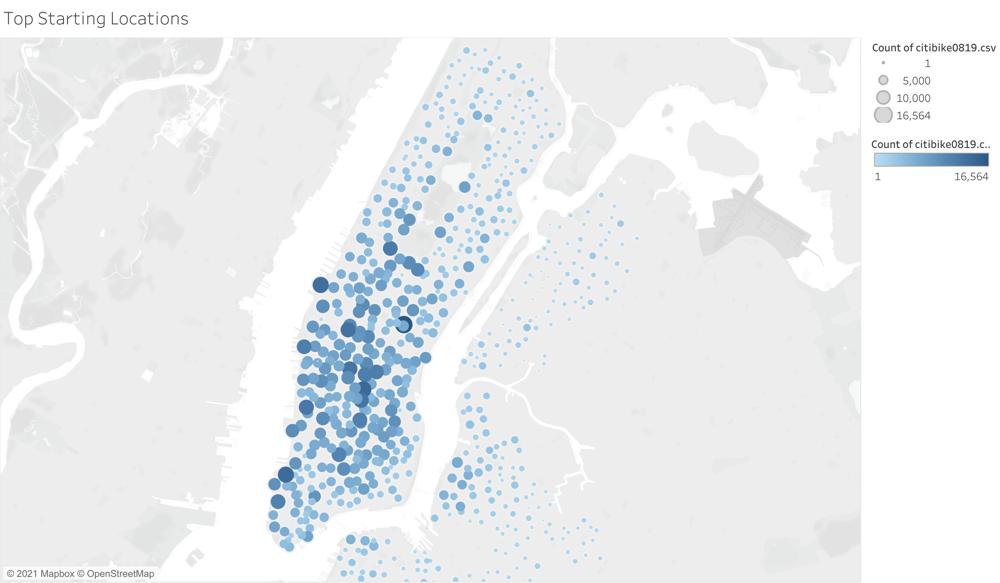
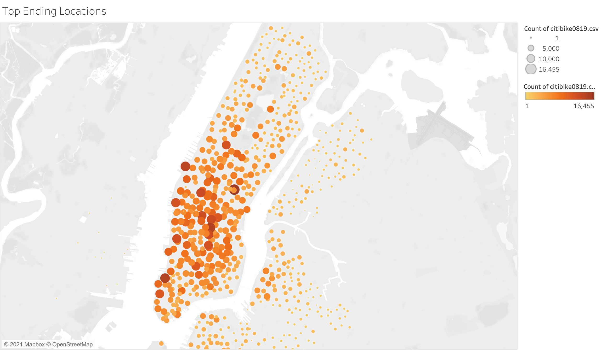

# bikesharing

Most trips start and end in midtown and downtown. This is a result of New Yorkers commuting to and from work and this conclusion will be reinforced by observing graphs related to trips by hour. 

Increased traffic is also observed in specific sites of Upper East and Upper West Side. We see the marks increase in size outside the Metropolitan Museum of Art, the Gugggenheim Museum and the Natural History Museum. This in its turn is a result of tourists visiting major city sites. 

Other areas of special interest are stations close to the Hudson River Greenway, Battery Park and the area around the World Trade Center. Sports facilities in the area together with a bike lane running the length of the river surely play a part in this. 

[Link to Dashboard >](https://public.tableau.com/views/citibike2_16317409939030/BikeSharing?:language=en-US&publish=yes&:display_count=n&:origin=viz_share_link)
