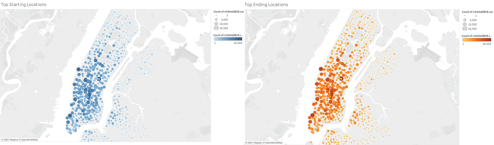
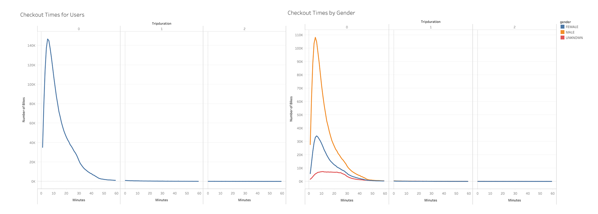
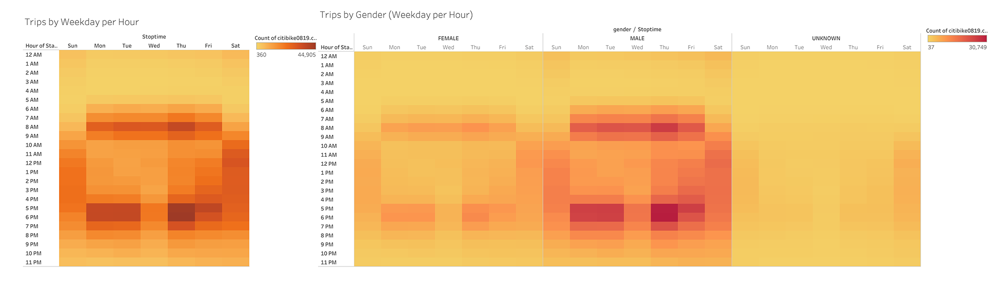

# bikesharing

## Analysis Overview
This analysis aims to provide an extensive breakdown of bike trip analysis for investors who are looking to see if the bike-sharing program is a solid business proposal. 

## Results
### Start and Stop Locations
Is bike sharing is a promising business proposal? To answer this question we will examine data from New York City's bike sharing program for the month of August, 2019. Looking at the first graph we see that most trips start and end in Midtown and Downtown. This declares the first major use of bike sharing. 
Increased traffic is also observed in specific sites of Upper East and Upper West Side. We see the marks increase in size outside the Metropolitan Museum of Art, the Gugggenheim Museum and the Natural History Museum. This in its turn is a result of tourists visiting major city sites. 

Other areas of special interest are stations close to the Hudson River Greenway, Battery Park and the area around the World Trade Center. Sports facilities in the area together with a bike lane running the length of the river surely play a part in this. As far as other burroughs are concerned, there is less bike sharing traffic with the exceptions of Dumbo area in Brooklyn as well as Williamsburg and Greenpoint further north. Dumbo attracts mostly visitors to the city while in the case of Williamsburg and Greenpoint we are dealing with residents of the area who love biking and use the program for their daily needs. 

### Trip Duration

The trip duration graphs show that most trips are in the 5 to 15 minute range. These short trips are probably workers commuting while at the same time longer trips are likely visitors of the city biking around. A very subtle and slight difference between male and female users exist in the duration of trips. Female users take slighlty longer trips and when we reach the very long trips levels (around 40 to 50 minutes) we see that the ratio between male and female users is almost balanced.

### Trips by day and hour of day

Trip volume increases during both morning and evening rush hour. It was expexted and by these graphs it is confirmed that the main audience for bike sharing are workers commuting. Between 7 and 9 AM and between 4 to 6PM there is an overwhelming increase of trips especially for male users. On another stage of our analysis we could look for trip duration by hour of trip and weekday to secure further insight on this primetime bike sharing event. Distribution of trips throughout the day is more even when it comes to female users. This likely indicates that female users do not favor biking as a means of commuting to work - or maybe that more female users have their own bikes. As we also see the graph also balances out for all users on Saturdays and Sundays where there is a more even trip distribution throughout the day. 

### Trips by Gender by Weekday

In this last graph the uneven ratio between male and female users is again evident and what is also impressive is the increase of trips on Thursdays and Fridays. While Friday is the start of the weekend which might inspire more bike rides, there is no apparent reason for Thursdays being the day when most trips take place. One explanation is that there are incoming visitors who start their visit in the city with a bike ride, just before the weekend. However, visitors of the city have not proven to be able to skew the graphs so we have to look elsewhere. Another reason to think of is students around the city who have their Friday off. Regardless of all these, the same weekly variation is observed in both male and female users. 

[To interact with the charts click here >](https://public.tableau.com/views/citibike2_16317409939030/BikeSharing?:language=en-US&publish=yes&:display_count=n&:origin=viz_share_link)
